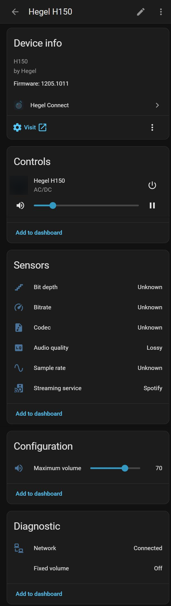

# Hegel Connect for Home Assistant

> **Unofficial community integration.** Not affiliated with, endorsed or supported by Hegel Music Systems AS. Hegel is a trademark of its owner.

Local-push integration for **Hegel H150, H200, H400 and H600** streaming amplifiers. It talks to the amplifier over your own network, the same way the amplifier's built-in web app does. No cloud, no account, and no polling: changes made on the amplifier, with its remote or in the Hegel Control app show up in Home Assistant right away (within a second on the maintainer's H150).

## Why this project

I bought a new Hegel H150 and found that my Logitech Harmony Elite could not control it. In mid-September 2026 I started with Home Assistant to bring all my devices together. I looked for an integration for the new streaming Hegels and could not find one in HACS, so I built Hegel Connect for my own H150. It works well enough that I decided to share it with the community.

## Which integration for my Hegel?

Hegel network amplifiers are controlled in two different ways:

| Generation | Models | How it is controlled | Use |
| :---- | :---- | :---- | :---- |
| **Streaming platform** | H150, H400, H600 (H200 expected) | Built-in streamer with a web API (the same one the Hegel Control app and the amplifier's web page use) | **Hegel Connect** (this integration) |
| **IP control** | Röst, H95, H120, H190, H190V, H390, H590 | Hegel IP control protocol on TCP port 50001 | The built-in [Hegel integration](https://www.home-assistant.io/integrations/hegel/) in Home Assistant (since 2026.3) |

Quick check: on the H150, `http://<amplifier-address>/webclient/` opens a Hegel page; an amplifier that does this uses the streaming platform. If you try to add an older amplifier to Hegel Connect, setup recognises it (it answers a read-only IP control status query) and points you to the built-in integration.

## Supported models

| Model | Status |
| :---- | :---- |
| H150 | ✅ Tested by the maintainer |
| H200 | 🟡 Expected to work, not tested yet |
| H400 | 🟡 Expected to work, not tested yet |
| H600 | 🟡 Expected to work, not tested yet |

Hegel groups the H150, H400 and H600 together for home automation ([Hegel support](https://support.hegel.com/product-articles/custom-install-sue)), so they are expected to behave the same. The H200 is a newer streaming model and is expected to work the same way; this is not confirmed yet. If you own an H200, H400 or H600, please [send a model report](../../issues/new?template=model_report.yml), even if everything works. It takes five minutes and helps everyone.

## Features



**Control**
- **Power**: on and network standby (the amplifier stays reachable in standby, so Home Assistant can switch it on)
- **Volume** (set and step) and **mute**, with a **maximum volume** that Home Assistant never exceeds
- **Inputs** read from the amplifier, so every model shows its own inputs
- **Reliable input switching**: waits until the amplifier is on, pauses a running stream and checks the input stays selected (seen on the H150: right after power-on it otherwise jumps back to Network)
- **Playback**: play, pause, next, previous and stop, **only where the current service allows it** (see below)
- **Media browser**: your internet radio favorites, all internet radio, **media servers** (UPnP/DLNA, e.g. your NAS), a **USB stick** in the amplifier (not tested yet) and recently played. Nothing to set up: Hegel Connect shows the servers the amplifier finds itself. Albums are started the same way as in the Hegel web client, so the amplifier continues with the next track; photo and video folders are left out
- **Radio favorites sensor** with the stations saved in the Hegel Control app, to build radio buttons on a dashboard

**Now playing and stream format**
- Title, artist, album, cover art, streaming service, track length and position
- Sensors: **audio quality** (Hi-Res, CD quality, Lossless, Lossy, DSD), **codec**, **sample rate**, **bit depth**, **bitrate**, **streaming service**. The codec decides first, so 16-bit/48 kHz MP3 radio is *Lossy*, not *CD quality*

**Status you can trust**
- **Instant updates** (local push): changes made with the remote, on the front panel or in an app show up right away, no polling
- **Network sensor**: standby (still on the network) and switched off at the mains are told apart; the media player then shows *off*, not *unavailable*
- **Starts while the amplifier is off at the mains** (e.g. a power strip switched off at night) and connects as soon as it is back
- **Fixed volume** indicator for inputs set to home theater bypass

**Setup**
- **Found automatically**, the same way the Hegel Control app finds it; a changed IP address is picked up by itself
- Older Hegel amplifiers are recognised during setup and pointed to the right integration
- **Diagnostics** download without IP address or device ids
- English, Dutch, Norwegian (Bokmål), German, French and Spanish

<br clear="right">

### What each streaming service allows

The amplifier reports per service which controls work; Hegel Connect follows it, so buttons that would fail are not offered. Tested on the H150; "not tested yet" means what the code expects, not what was seen.

| Source | Format shown | Next / previous | Stop |
| :---- | :---- | :---- | :---- |
| Spotify Connect | Service and quality only (Spotify sends no codec or bitrate) | No: the amplifier refuses it | Not offered (to keep the session with your phone) |
| Internet radio | Codec, bit depth, sample rate, bitrate | No | Offered |
| Media server (UPnP/DLNA, e.g. FLAC from a NAS) | Codec, bit depth, sample rate, bitrate | Yes (tested) | Offered (not tested yet) |
| TIDAL / Qobuz Connect | Not tested yet | Not tested yet | Offered (not tested yet) |
| AirPlay (e.g. Apple Music) | AirPlay's own label, like the Hegel web client (not tested yet) | Not tested yet | Offered (not tested yet) |
| Google Cast (e.g. YouTube Music) | Not tested yet | Not tested yet | Offered (not tested yet) |

With Spotify Connect, *play* after *pause* uses Spotify's own resume action; on the H150 a plain play command was refused there and stopped the session.

### Entities

For an amplifier named *Hegel H150*:

| Entity | |
| :---- | :---- |
| `media_player.hegel_h150` | Power, volume, mute, input, playback, now playing, media browser |
| `sensor.hegel_h150_audio_quality` | Hi-Res, CD quality, Lossless, Lossy, DSD (while the streamer plays) |
| `sensor.hegel_h150_codec`, `_sample_rate`, `_bit_depth`, `_bitrate`, `_streaming_service` | Stream details, when the service reports them |
| `sensor.hegel_h150_radio_favorites` | Number of radio favorites; the list (title, icon, path) as attribute, for radio buttons on a dashboard |
| `number.hegel_h150_maximum_volume` | Volume ceiling for Home Assistant (configuration) |
| `binary_sensor.hegel_h150_network` | On while the amplifier answers, standby included (diagnostic) |
| `binary_sensor.hegel_h150_fixed_volume` | On when the current input uses fixed volume (diagnostic) |

Entity ids follow your Home Assistant language; the names above are the English ones.

### Examples

Quieter in the evening:

```yaml
automation:
  - alias: Hegel volume limit at night
    triggers:
      - trigger: time
        at: "22:00:00"
    actions:
      - action: number.set_value
        target:
          entity_id: number.hegel_h150_maximum_volume
        data:
          value: 40
```

Play the first radio favorite from a script or button:

```yaml
action: media_player.play_media
target:
  entity_id: media_player.hegel_h150
data:
  media_content_type: hegel_path
  media_content_id: "{{ state_attr('sensor.hegel_h150_radio_favorites', 'favorites')[0].path }}"
```

Play an album from your NAS from a script or button. In the script editor, add the action *Media player: Play media*, choose the Hegel and click *Pick media*: you browse the same folders as in the media browser. The result looks like this (the id comes from your media server; if the server re-indexes your library it can change):

```yaml
action: media_player.play_media
target:
  entity_id: media_player.hegel_h150
data:
  media_content_type: hegel_path
  media_content_id: "upnp:/uuid:<server>/<album>?itemType=container"
```

## Installation

Developed and tested on Home Assistant 2026.9; HACS allows installing it on 2025.2 and newer. The integration's own icon is shown from Home Assistant 2026.3 ([brand images](https://developers.home-assistant.io/blog/2026/02/24/brands-proxy-api)); older versions show no icon.

### HACS (recommended)

1. HACS > ⋮ > *Custom repositories* > add `https://github.com/Elpea-byte/ha-hegel-connect`, type *Integration*.
2. Search for **Hegel Connect** and download it.
3. Restart Home Assistant.

### Manual

Copy `custom_components/hegel_connect` to the `custom_components` folder of your Home Assistant configuration and restart.

## Configuration

The amplifier is **discovered automatically**, the same way the Hegel Control app finds it (mDNS service `_sues800device._tcp`), with UPnP/DLNA and Google Cast as backups. Home Assistant then shows it under Settings > Devices & services > *Discovered*; click *Add*.

Not discovered (other subnet/VLAN, multicast blocked)? Add it by hand: *Add integration* > **Hegel Connect** > enter the IP address.

A fixed IP address (DHCP reservation in your router) is still recommended. If the address does change, Home Assistant picks up the new one by itself the next time it sees the amplifier on the network.

**Maximum volume** is a setting on the device page (a number entity, so automations can change it). Home Assistant will never set the volume above it; the amplifier's own remote and knob are not limited.

## Troubleshooting

Enable debug logging and reproduce the problem:

```yaml
logger:
  default: warning
  logs:
    custom_components.hegel_connect: debug
```

Then open an [issue](../../issues/new/choose) with the log and the diagnostics file (Settings > Devices & services > Hegel Connect > ⋮ > *Download diagnostics*).

## Known limitations

- Spotify Connect: next/previous and stop are not available through the amplifier (it only allows pause); use the Spotify app or Home Assistant's Spotify integration for skipping.
- Radio favorites are managed in the Hegel Control app; Home Assistant shows and plays them.
- No network command is known for the DAC and display buttons of the Hegel remote, so Hegel Connect does not offer them.
- Tested on the H150 only; H200, H400 and H600 reports are very welcome.
- The network input is recognised by its name "Network", as the amplifier reports it. If a future firmware renames it, now playing and the stream sensors stay empty; please open an issue.
- The amplifier's local API has no password. Hegel Connect checks that a device really is your amplifier (its id) before using a new address, but a device on your network that imitates the whole Hegel API cannot be told apart. Keep the amplifier on a trusted network.

## How it works

Hegel Connect uses the same local web API as the amplifier's own web page and the Hegel Control app: `/api/getData`, `/api/setData` and a long-polling event queue under `/api/event`. Nothing leaves your network.

## Related projects

[hegel-home-assistant](https://github.com/zerostorypoints/hegel-home-assistant) (`hegel_streaming`, MIT) targets the same amplifiers through the same local API. Matching discovery on the `manufacturer`/`uuid` TXT records and reading the id from `systemmanager:systemMember` were inspired by it.

## Development

The client in `custom_components/hegel_connect/api.py` has no Home Assistant dependencies and may move to its own package later. Tests replay a real H150 recording (`tests/fixtures/h150_session.json`):

```bash
pip install -r requirements_test.txt
pytest
```

## Contributing

Bug reports, model reports and pull requests are welcome; see [CONTRIBUTING.md](CONTRIBUTING.md). Changes per version are in [CHANGELOG.md](CHANGELOG.md).

## Support the project

Hegel Connect is free and stays free. If it makes your listening a bit easier and you want to say thanks, you can buy me a coffee. It helps me keep testing, fixing and adding support for more models.

[](https://ko-fi.com/elpeabyte)

## License

MIT
